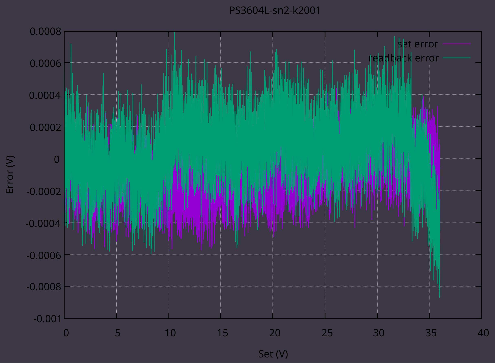
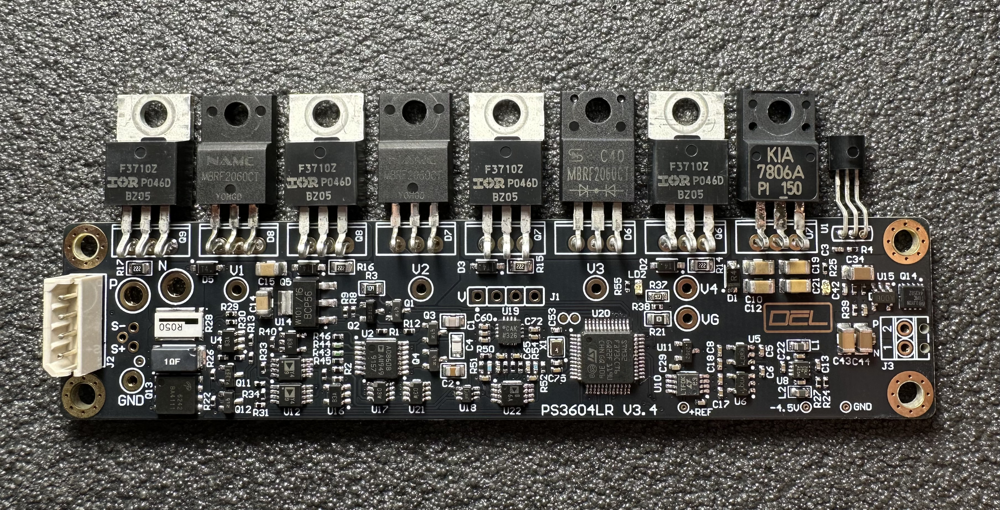
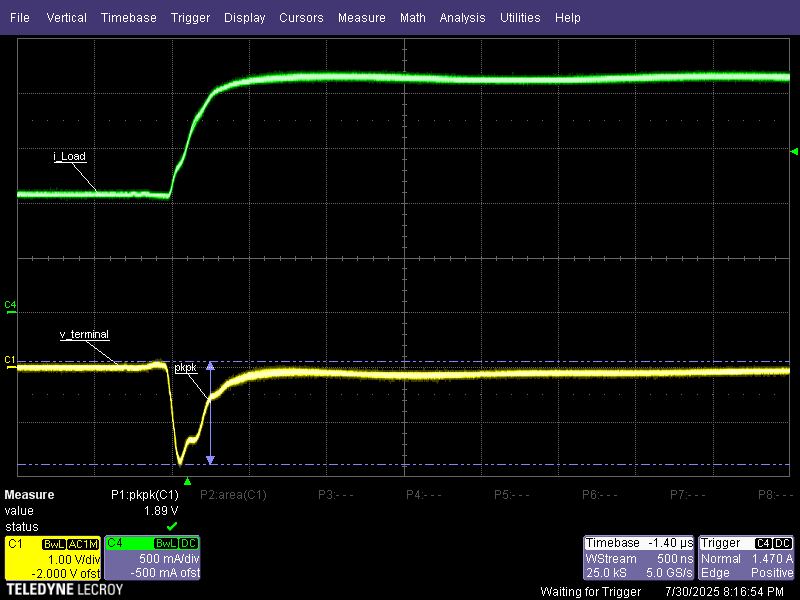
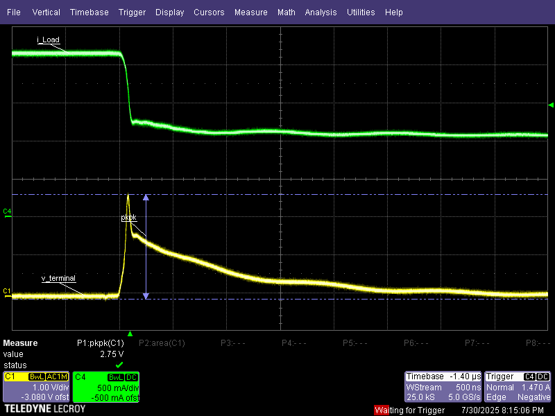
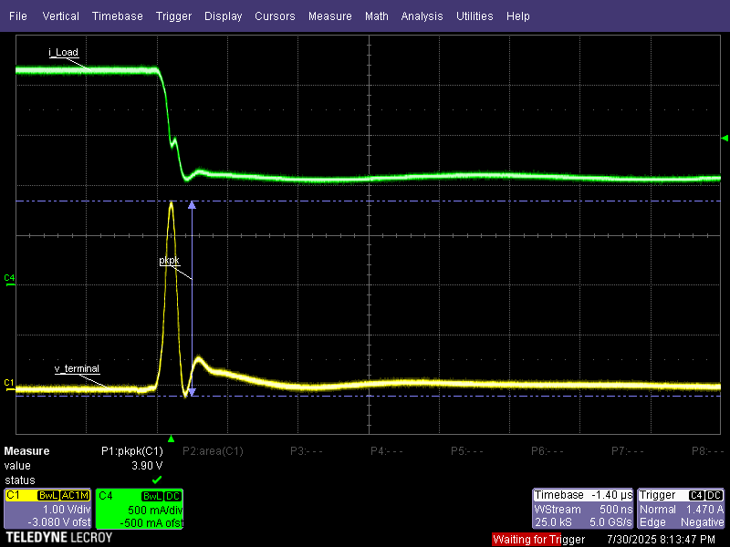
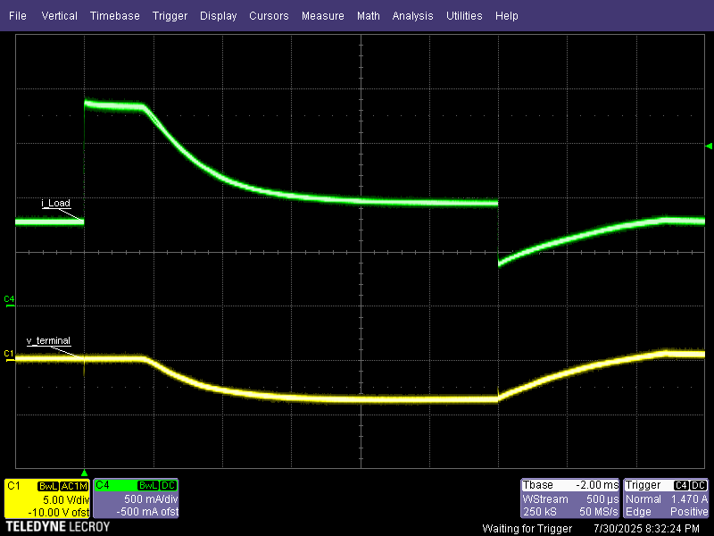
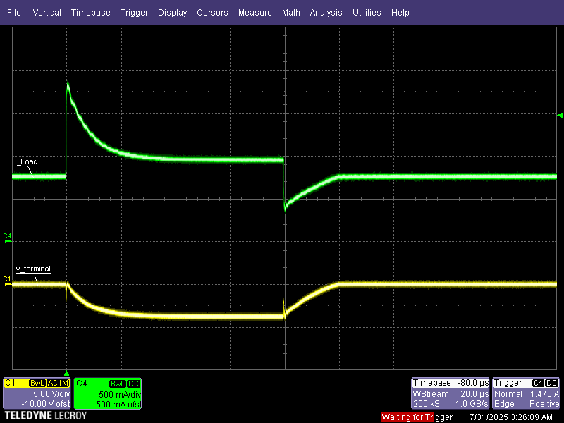
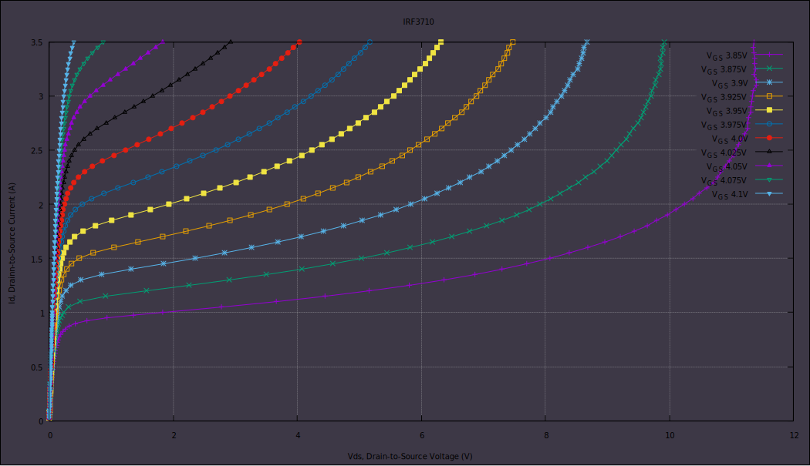

# PS3604L

## Overview

The PS3604L is a 144 Watt, high performance dc power supply with output current measurement capability in the microampere range.
Combination of bench-top and system features in these dc source.
For more photos to /Photo.

### Convenient bench-top features

- Up to 144 Watts output power
- Easy to use knob for voltage and current settings
- IPS 160x128 pixel front panel display
- Excellent load and line regulation; low ripple and noise
- Measurement capability down to microampere levels
- Light weight

### Flexible system features

- 10/100BASE-T Ethernet

- Modbus TCP for remote programming

- Web interface for monitoring

## Specifications

Unless otherwise noted, specifications apply when measured after a 30-minute warm-up period.

### Performance Specifications

| Parameter                                                    |                                                           |                             |
| :----------------------------------------------------------- | --------------------------------------------------------: | :-------------------------: |
| **Output Ratings**                                           |                                    Voltage: Current: |    0 – 36 V 0 – 4 A    |
| **Programming Accuracy** (@ 25°C ±5°C)                   |                                    Voltage: Current: |        5 mV 2mA        |
| **DC Measurement Accuracy** (@ 25°C ±5°C)               | Voltage: Current 0 – 1 mA: Current 0.001 – 4 A: | 5 mV 0.01 mA 2 mA |
| **Ripple and Noise**                                         |                        Voltage: (rms) Current (rms): |     0.5 mV 1.5 mA      |
| **Load Regulation**                                          |                                                       TBD |             TBD             |
| **Line Regulation** (change in output voltage or current for any line change within ratings) |                                                       TBD |             TBD             |
| **Transient Response Time** *1                          |                                                           |           < 50 μs           |

1. For the output voltage to recover to its previous level within 0.1% of the voltage rating of the unit or 20 millivolts following a
   change in load current of up to 50% of the output current rating

Short term voltage accuracy:

### Supplemental Characteristics

| Parameter                                                    |                                                              |                                               |
| ------------------------------------------------------------ | -----------------------------------------------------------: | :-------------------------------------------: |
| **Input Rating** (at full load )                         |                                               230 Vac mains: | 230 Vac nominal, 50/60 Hz, 0.85A, 200 VA max. |
| **Average Programming Resolution**                       | Voltage (panel): Voltage (remote) Current (panel): Current (remote) |   10 mV<br 1 mV 1 mA 0.1 mA    |
| **Output Voltage Rise/Fall Time** (for a change from 10% to 90% or 90% to 10% of the total excursion) |                                               Rise Fall |             < 80 μs < 10 μs              |
| **Command Processing Time**                                  |                                                              |                     10 ms                     |
| **Isolation to Ground** (Maximum from either output terminal to chassis) |                                                              |                    200 Vdc                    |
| **Dimensions**                                               |                              Height: Width: Depth: |         78 mm 158 mm 268 mm         |
| **Net weight**                                               |                                                              |                   3.850 kg                    |

------

## Structure

The device has the following modules: Transformer, Rectifier, Regulator, and Front Panel. The structural diagram is shown below.

------

## Linear regulator

Linear regulator is a separate module. Module mounted on back aluminum radiator.
Regulator is four level voltage regulator. Hardware CC/CV detector.
Controlled by STM32F337. Used AD4680 SAR 16bit (18bit oversampling mode) for measure voltage and current.
AD5060 16bit DAC use for current and voltage setpoint.
Fan speed proportional control for minimize sound noise.
Module communicate by UART ModBus.
Module [schematic](PCB/PS3604LR/output/PS3604LR.PDF).

Measurement and comparison of the transient process.
Semiconductor resistors and a switch controlled by a functional generator are used as a transient generator.
One resistor with a resistance of 10 Ohms is connected in parallel to the output of the device under test, the second resistor with a nominal value of 7.3 Ohms is connected in parallel to the device under test through a controlled switch.
Current measurement is performed using a Lecroy AP015 current probe. The voltage measurement is performed directly at the terminals of the device under tested using a high impedance passive probe.

Test 1. Both devices are set up the same, 8V 4A, the table shows the graphs of the current rise transient process measurement:

|                        Agilent 6611C                         |                           PS3604L                            |
| :----------------------------------------------------------: | :----------------------------------------------------------: |
|  |  |

Test 2. Both devices are set up the same, 8V 4A, the table shows the graphs of the current fall transient process measurement:

|                        Agilent 6611C                         |                           PS3604L                            |
| :----------------------------------------------------------: | :----------------------------------------------------------: |
|                                                              |                                                              |
|  |  |

Test 3. Both devices are set up the same, 8V 1A, the table shows the graphs of the current rise transient process measurement:

|                        Agilent 6611C                         |                           PS3604L                            |
| :----------------------------------------------------------: | :----------------------------------------------------------: |
|                                                              |                                                              |
|  |  |

In more detail, PS3604L:

------

## Front panel

Front panel is GUI and Ethernet bridge.  
Build on STM32F407 MCU, LAN8720 as Eth PHY.  
Module [schematic](PCB/PS3604LF/Project%20Outputs%20for%20PS3604LF/PS3604LF.PDF).

------

## Extra application

1. Measure series output characteristics of a MOSFET. [Link](/Firmware/Scripts/x-curve.py) to script.

