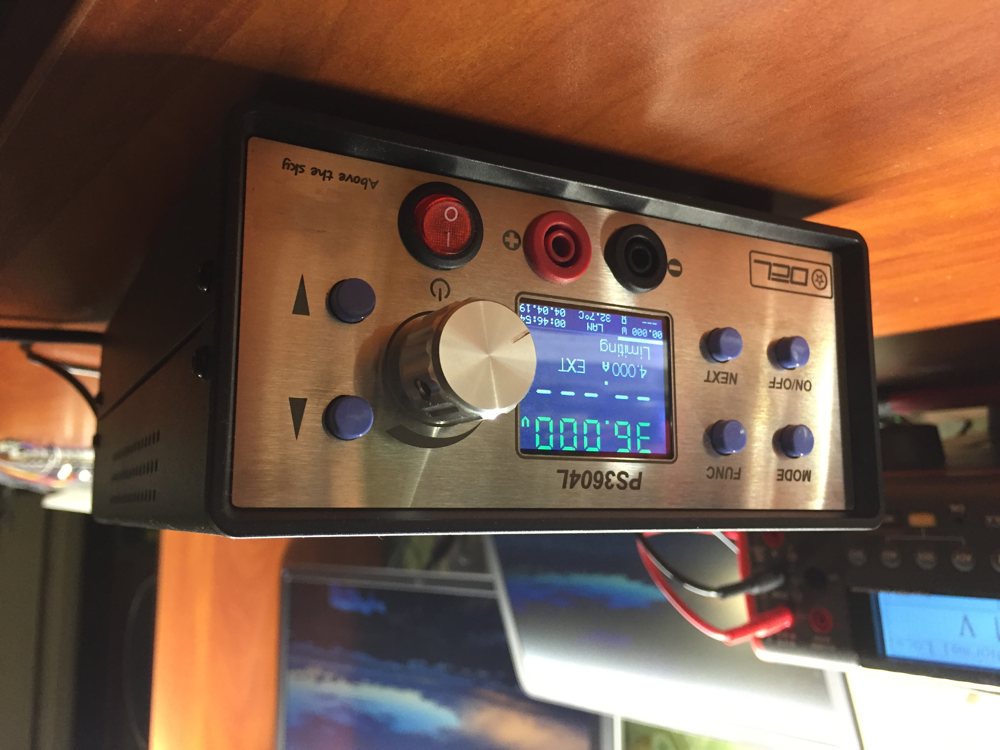

# PS3604L

PS3604 is low noise fast response linear laboratory power supply.

## Overview

- dimension 150 x 77 x 268 mm
- weight 3.850 kg
- 0-36V, step 0.01V
- 0-4A, step 0.001A
- CC/CV/Break_on_current
- battery charger mode
- input 200-240V
- Ethernet, controlled by TCP ModBus. Use this feature for electronic test automation ([measure I-V](Firmware/Scripts/iv-curve.py), stress test)
- RTC automatically sync with NTP server.

Device appearance. For more photos to /Photo.

## Linear regulator

Linear regulator is a individual module. Module mounted on back panel-cooler.  
Used fan speed proportional control for minimize noise.  
Module communicate by UART ModBus.  
Regulator is 4 level voltage regulator with current limit. Hardware CC/CV detector.  
Controlled by STM32F337. Used 16bit delta-sigma ADC for measure voltage and current.  
For measure low current used INA229. Internal 12bit DAC use for current and voltage setpoint.  
Module [schematic](PCB/PS3604LR/Project%20Outputs%20for%20PS3604LR/PS3604LR.pdf).

## Front panel

Front panel is GUI and Ethernet bridge.  
Build on STM32F407 MCU, LAN8720 as Eth PHY.  
Module [schematic](PCB/PS3604LF/Project%20Outputs%20for%20PS3604LF/PS3604LF.PDF).

