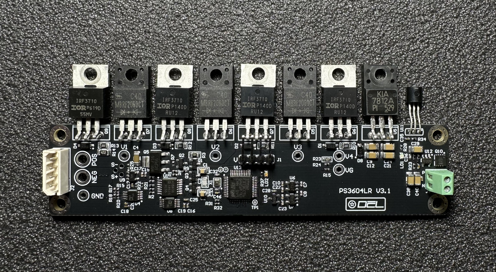
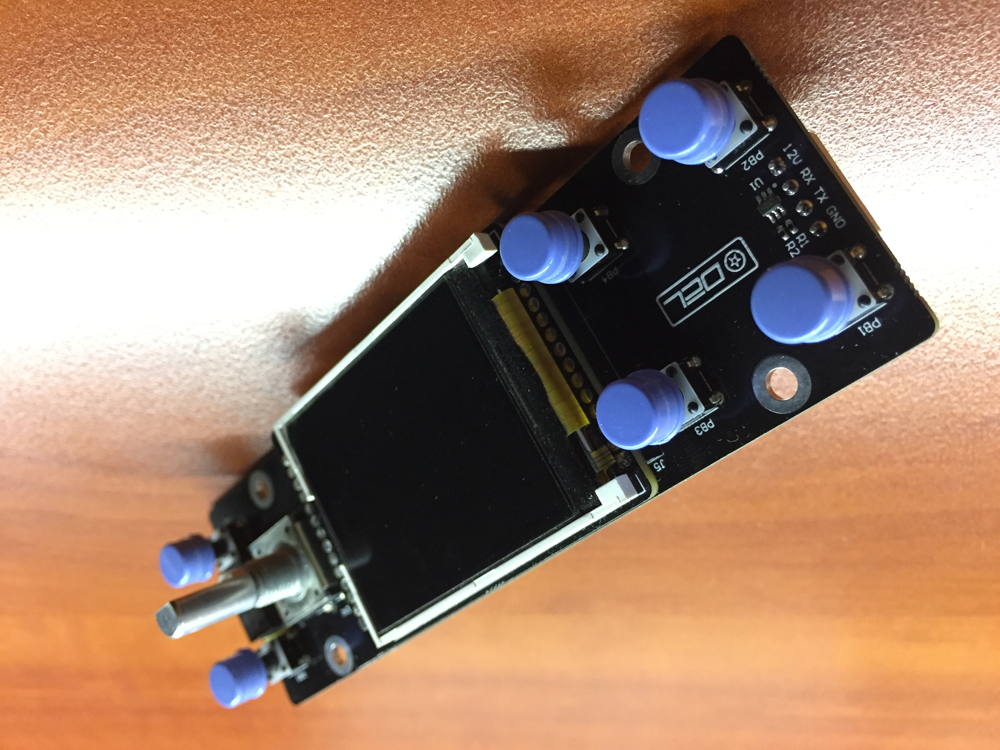

# PS3604L

## Overview

The PS3604L is a 144 Watt, high performance dc power supply with output current measurement capability in the microampere range.
Combination of bench-top and system features in these dc source.
For more photos to /Photo.

### Convenient bench-top features

- Up to 144 Watts output power
- Easy to use knob for voltage and current settings
- IPS 160x128 pixel front panel display
- Excellent load and line regulation; low ripple and noise
- Measurement capability down to microampere levels
- Light weight

### Flexible system features

- 10/100BASE-T Ethernet

- Modbus TCP for remote programming

- Web interface for monitoring

## Specifications

Unless otherwise noted, specifications apply when measured after a 30-minute warm-up period.

### Performance Specifications

| Parameter                                                    |                                                           |                              |
| :----------------------------------------------------------- | --------------------------------------------------------: | :--------------------------: |
| **Output Ratings**                                           |                                    Voltage: Current: |    0 – 36 V 0 – 4 A     |
| **Programming Accuracy** (@ 25°C ±5°C)                   |                                    Voltage: Current: |        10 mV 1mA        |
| **DC Measurement Accuracy** (@ 25°C ±5°C)               | Voltage: Current 0 – 1 mA: Current 0.001 – 4 A: | 10 mV 0.01 mA 1 mA |
| **Ripple and Noise**                                         |                                                       TBD |             TBD              |
| **Load Regulation**                                          |                                                       TBD |             TBD              |
| **Line Regulation** (change in output voltage or current for any line change within ratings) |                                                           |                              |
| **Transient Response Time** *1                          |                                                       TBD |             TBD              |

1. For the output voltage to recover to its previous level within 0.1% of the voltage rating of the unit or 20 millivolts following a
   change in load current of up to 50% of the output current rating

### Supplemental Characteristics

| Parameter                                                    |                                                              |                                               |
| ------------------------------------------------------------ | -----------------------------------------------------------: | :-------------------------------------------: |
| **Input Rating** (at full load )                         |                                               230 Vac mains: | 230 Vac nominal, 50/60 Hz, 0.85A, 200 VA max. |
| **Average Programming Resolution**                       | Voltage (panel): Voltage (remote) Current (panel): Current (remote) |   10 mV<br 1 mV 1 mA 0.1 mA    |
| **Output Voltage Rise/Fall Time** (for a change from 10% to 90% or 90% to 10% of the total excursion) |                                                          TBD |                      TBD                      |
| **Command Processing Time**                                  |                                                              |                     10 ms                     |
| **Isolation to Ground** (Maximum from either output terminal to chassis) |                                                              |                    200 Vdc                    |
| **Dimensions**                                               |                              Height: Width: Depth: |         78 mm 158 mm 268 mm         |
| **Net weight**                                               |                                                              |                   3.850 kg                    |

## Linear regulator

Linear regulator is a individual module. Module mounted on back cooler.
Regulator is four level voltage regulator. Hardware CC/CV detector.
Controlled by STM32F337. Used 16bit delta-sigma ADC for measure voltage and current.
For measure low current used INA229.
AD5663 16bit DAC use for current and voltage setpoint.
Used fan speed proportional control for minimize noise.
Module communicate by UART ModBus.
Module [schematic](PCB/PS3604LR/Project%20Outputs%20for%20PS3604LR/PS3604LR.pdf).

## Front panel

Front panel is GUI and Ethernet bridge.  
Build on STM32F407 MCU, LAN8720 as Eth PHY.  
Module [schematic](PCB/PS3604LF/Project%20Outputs%20for%20PS3604LF/PS3604LF.PDF).

